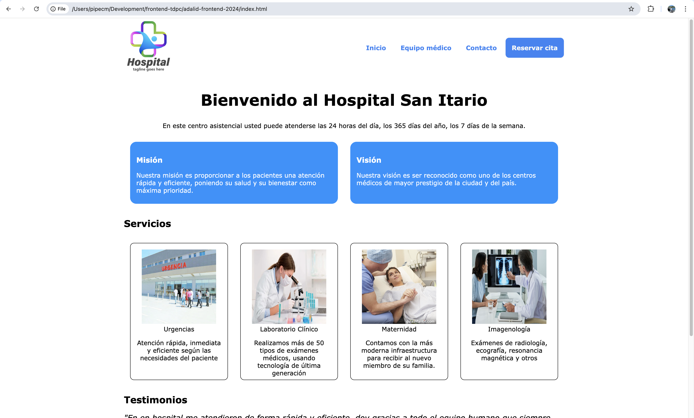

# Sitio Web Hospital San Itario (v2)
Repositorio que contiene la capa de front-end del sitio web del Hospital San Itario.

## Alumnos
Felipe Cárdenas Molina

*Nota: Al momento de la entrega no encontré compañer@ de grupo disponible*

## Despliegue local
Para desplegar el sitio en su ambiente local, se debe realizar lo siguiente:

1. Clonar el repositorio del sitio web:
```
git clone git@github.com:pipecm/adalid-frontend-m3-grupal.git
```

2. Acceder a la carpeta recientemente descargada:
```
cd adalid-frontend-m3-grupal
```

3. Ejecutar el comando para instalar las dependencias de Bootstrap:
```
npm install
```

4. Ejecutar el comando que imprime el directorio actual:
```
pwd
```

5. Copiar el resultado obtenido, abrir un browser y pegar la ruta obtenida, seguido de `/index.html`, por ejemplo:

```
/home/myself/development/adalid-frontend-m3-grupal/index.html
```

Si todo lo anterior se realizó correctamente, se debería visualizar el sitio web como en la imagen siguiente:



## Vistas
|Página                         |Funcionalidad                            |
|-------------------------------|-----------------------------------------|
|[index.html](index.html)       |Home del sitio, contiene la información principal del hospital (misión, visión, servicios, etc.                   |
|[staff.html](staff.html)       |Equipo médico del hospital, especialidades y experiencia relevante.                                 |  
|[contact.html](contact.html)   |Formulario de contacto                 |
|[appointment.html](appointment.html)   |Formulario de solicitud de citas 

## Implementación de objetos JSON
Los objetos JSON de datos se implementaron codificados en duro en los ficheros del directorio `data`. 

### Operaciones
* __Clonación:__ Para clonar objetos JSON se utilizaron en conjunto los métodos `JSON.stringify()` y `JSON.parse()`, de manera que al hacer cambios en el objeto clonado no se reflejen en el objeto original, sino que sólo en el nuevo.
* __Merge:__ Se utilizó el operador de deconstrucción (`...`) para crear un objeto con información de un doctor en [app.js](scripts/app.js)].
* __Recorrido:__ Para recorrer los JSON se usaron principalmente operaciones _lambda_ como `forEach()`o `map()` en lugar de recorrerlos usando ciclos `for` o `(do) while`.

## Estructuras de datos implementadas en el proyecto
Las estructuras de datos fueron implementadas en el archivo `structures.js`. Estas son:

* __Cola:__ A través de la clase `Queue`, se realizó su implementación de forma análoga a como se hizo con la cola, esto es, usando un array como base y sus operaciones correspondientes como `enqueue()` y `dequeue()`.

## Algoritmos y complejidad
* __Búsqueda:__ El algoritmo de búsqueda implementado en la función `findDoctorByName()` usa el principio de la búsqueda binaria, el cual devuelve el índice donde el elemento buscado se ubica en el arreglo. Nótese que el arreglo está ordenado ascendentemente en base a los años de experiencia de los doctores. Al estar basado en la búsqueda binaria, este algoritmo tiene complejidad `O(log n)`.
* __Ordenamiento:__ El algoritmo para ordenar los doctores ascendentemente según su edad se implementó en la función `sortDoctorsByYearsOfExperience()`. Dado que se basa en el algoritmo de ordenamiento InsertionSort, éste presenta una complejidad de `O(n^2)`.

## Uso de programación funcional
* En `functions.js` se realizaron las implementaciones de las diversas funciones requeridas. En ellas se usaron las diversas técnicas estudiadas en el curso, tales como composición, try/catch y `Promise`.

## Eventos y asincronía
* En el botón para atender nuevo paciente y en el formulario de solicitud de atención de [appointment.html](appointment.html) se añadieron listeners de eventos, los cuales se gatillan al momento de presionarse los botones correspondientes `Enviar` y `Atender al próximo paciente`.
* En la función `getPastAppointments()` se implementó la simulación de una llamada REST, usando conjuntamente `Promise` y async/await para lograr este fin.  

## Orientación a objetos
En `entities.js` se implementaron las clases `Doctor` y `Cardiologo`, en donde la segunda hereda de la primera. `Cardiologo`, haciendo uso del polimorfismo, sobreescribe el método `showInfo()` para generar la información del doctor, mencionando que tal es específicamente un `Cardiologo`.

